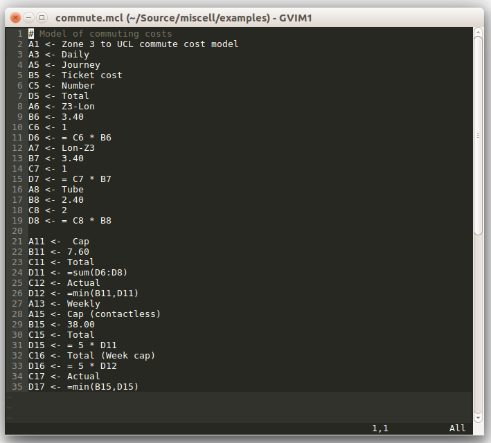
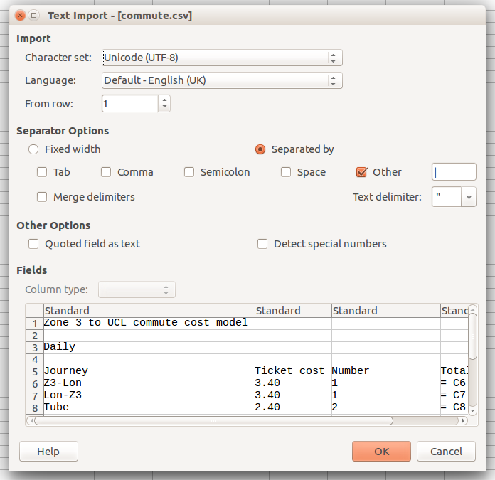
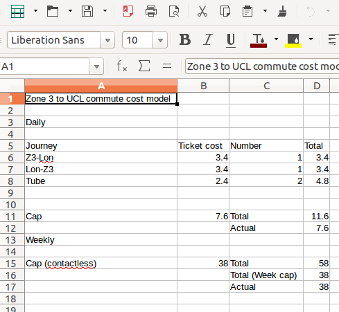

# miscell
## A language for writing spreadsheets

On Wednesday 22nd of June 2016, I attended a [talk](https://github.com/triangle-man/intro-to-cellular-talk) given by James Geddes ([@triangle-man](https://github.com/triangle-man)) about his Cellular project which aims to bridge the divide between coding and spreadsheets.  In it he described a fairly large and complex system he intends to build which will allow users to write some code in a to be designed programming language, put it through a compiler and have it spit out a spreadsheet.

As part of the talk he described an intermediate language which looks something like this...

```none
A1:=45
A2:=57.3
B1:=A1*A2
```

... and is the text file representation of the data you enter into a spreadsheet.

I am an impatient man, and I really want to be able to not edit spreadsheets as soon as possible, and this intermediate language looks friendly enough for me, so I decided to start writing something to parse a language like that and generate a .CSV file which could be loaded into your spreadsheet of choice.

Over a couple of lunch breaks, I've written this prototype which I fully intend to re-write and expand on with more features as time goes on.  Currently it's exceedingly basic, a proof of concept more than anything else and you probably shouldn't use it at all, but I'm putting it in github so I can easily work on it wherever I am.

It's MIT licensed, so knock yourselves out.

## Language 

At the moment miscell can cope with only one type of statement, and that's one where you assign some expression to a cell on the left side of the statement.

e.g.

```none
A1 <- 56
```

when compiled will produce a spreadsheet where A1 is 56.

You can also assign the other way so:

```none
56 -> A1
```

Is the same as the previous statement.

You can include expressions in "spreadsheet language" and they'll be interpreted (or at least they are in LibreOffice and Excel).

```none
A1 <- 2
A2 <- 3
B1 <- = A1 * A2
=A1 * A2 -> B2 #B2 will have the same value as B1
```

Will generate a spreadsheet where A1 is 2, A2 is 3 and B1 and B2 are the expression "= A1 * A2".

Comments *must* start with a "\#".

You can import other CSV files to use as datafiles.  This can be done with statements like:

```none
data: A6 examples/data.csv ,
```

which would import the file *examples/data.csv* into the current sheet starting at location A6, and that the separator in *examples/data.csv* is a comma.

## Operation

First, write a program in your editor of choice.



Then invoke miscell withe the *miscellc.py* command like so:

```bash
$ ./miscellc.py -i examples/commute.mcl -o commute.csv
```

By default, miscell uses a pipe "|" as a separator, but you can specify any string you like with the *-s* option.

You can then open the CSV file with your chosen spreadsheet, remembering to set the separator appropriately.



And there you have it.



You can convert CSV files to MCL files with the *-b* option.

```bash
$ ./miscellc.py -b -i examples/data.csv  -s , -o data.mcl
```

This converts *examples/data.csv* (which uses the separator *,*) to *data.mcl*.

## To come(!)

* Support re-writing of "data" CSV sheets
* Robustness (there is currently little as this is a proof of concept)
